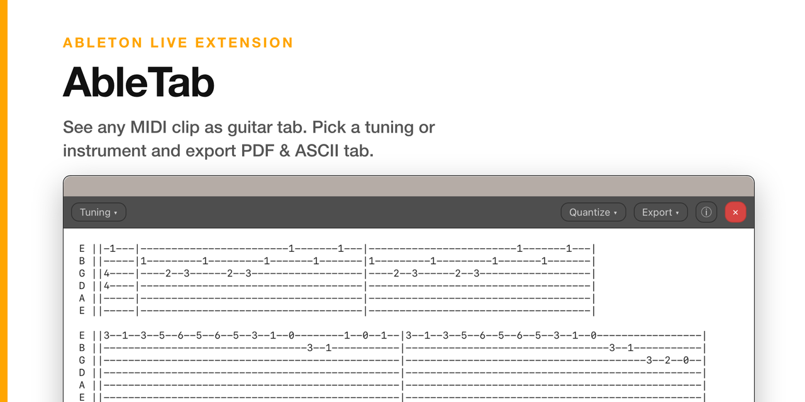
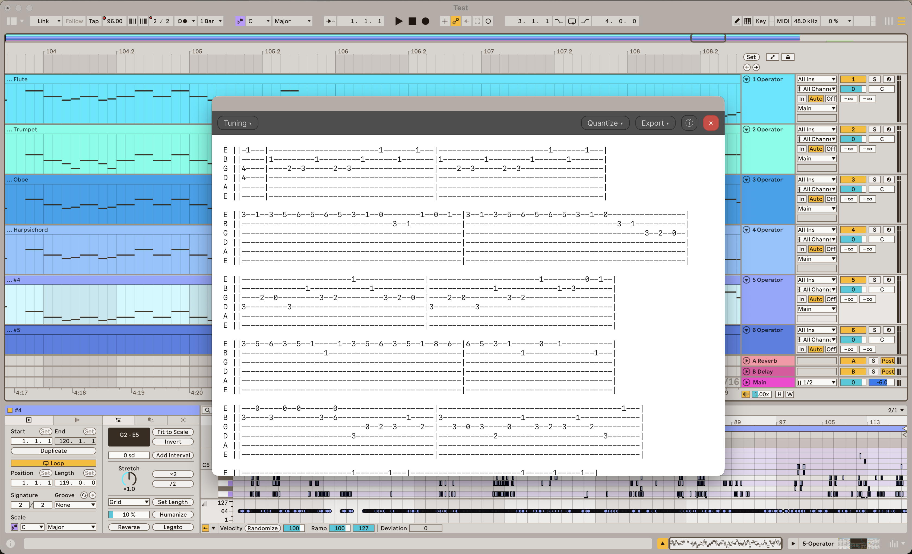

# AbleTab

[](https://github.com/madisonrickert/abletab/actions/workflows/ci.yml)
[](https://github.com/madisonrickert/abletab/releases/latest)
[](LICENSE)
[](https://www.ableton.com/en/live/extensions)
[](https://github.com/madisonrickert/abletab/stargazers)

View any MIDI clip in Ableton Live as stringed-instrument tablature. Pick an instrument preset or dial in a custom tuning, then export **PDF** or **ASCII tab**. Built on the [Ableton Live Extensions SDK](https://www.ableton.com/en/live/extensions) (beta).



## Features

- **Smart tab conversion**: Renders a selected MIDI clip as monospace tablature. Fingerings are chosen by [tutts](https://github.com/madisonrickert/tutts), an HMM/Viterbi engine that picks the easiest playable path across the whole clip.
- **Instrument presets**: Standard Guitar, Drop D, DADGAD, Open G, 7-String Guitar, Bass, and Ukulele, plus a fully custom mode: 4 to 8 strings, any per-string tuning, configurable fret count.
- **Quantize**: Snap onsets to a 1/4 to 1/32 grid, or turn snapping off.
- **Octave shift with range detection**: When a part sits outside the instrument's range, an info bar offers the one-click octave shift that fits it best; or shift manually from the Tuning menu.
- **Export**: **PDF** and **ASCII tab** (`.txt`, wrapped at a column width you choose).

## Install

Download the latest **`.ablx`** from the [**Releases** page](https://github.com/madisonrickert/abletab/releases/latest), then:

1. In Ableton Live, open **Preferences → Extensions** (with Developer Mode **off**, so Live manages the extension).
2. Drag the `.ablx` onto that page.
3. Right-click any MIDI clip → **Extensions → Show Tab**.

Requires **Ableton Live Suite 12.4.5 or newer with Extensions** (currently in beta).



### Limitations

- The time signature comes from the first scene of the Set (the SDK does not expose the clip's own scene or the global signature); clips in other signatures render with the first scene's barring.
- Tab is read-only: note edits happen in Live's piano roll.

## Build from source

This project depends on the Ableton Extensions SDK, which is not published to npm and is not bundled here. Obtain it from Ableton, then:

```bash
cp .env.example .env          # set ABLETON_SDK_PATH to your unpacked SDK
npm run setup                 # vendor the SDK tarballs + install
npm start                     # build + run in the Extensions CLI
```

| Command | Purpose |
|---|---|
| `npm test` | Pure unit tests (CI-safe; no SDK needed). |
| `npm run test:integration` | `tutts` pipeline + license-notice tests. |
| `npm run typecheck` | Type-check the Node side + the webview. |
| `npm run build` | Production build → `dist/extension.js`. |
| `npm run package` | Build the installable `.ablx` into `release/`. |

## Acknowledgements

Fingering algorithm is powered by [tutts](https://github.com/madisonrickert/tutts), a TypeScript port of [tuttut](https://github.com/natecdr/tuttut).

## Other extensions by the developer

AbleTab is my third extension. Go check out my others!

- [Sheet Music](https://github.com/madisonrickert/ableton-sheet-music-extension): View an Ableton Live MIDI clip as sheet music
- [AbleVSEP](https://github.com/madisonrickert/ablevsep): Separate any audio clip into stems with any of MVSEP's 100+ models, right inside Ableton Live 
